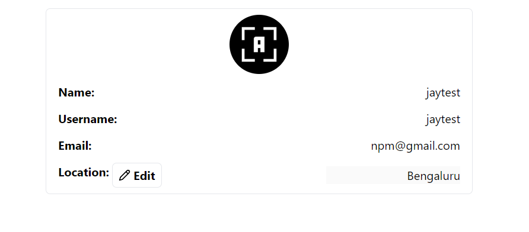

## Project Documentation: User Profile Management Assignment

### Overview

## This project is a React application for managing user profiles. It allows users to view and edit their profile information, including their name, username, email, and location.

### Components

#### App Component (`App.tsx`)

- Responsible for fetching and displaying user profile data.
- Handles errors and provides a retry mechanism.
- Utilizes the `Profile` component to render the user profile.

#### Profile Component (`Profile.tsx`)

- Displays the user's profile information.
- Provides functionality to edit the user's location.
- Uses local storage to store and retrieve user location data.
- Utilizes Lucide React icons for the edit button.

#### Interfaces (`user.d.ts`)

- Defines the shape of the user profile object (`IUser`).

### Features

#### Fetching User Profile

- Retrieves user profile data from an API endpoint using Axios.
- Stores the fetched profile data in local storage for caching.

#### Displaying User Profile

- Renders the user's profile information, including name, username, email, and avatar.

#### Editing User Location

- Allows users to edit their location information.
- Provides an edit button to toggle between edit and save modes.
- Updates the location in real-time and saves it to local storage.

#### Error Handling

- Displays error messages when there's a failure in fetching user profile or location data.

### Dependencies

- **axios**: For making HTTP requests.
- **lucide-react**: For rendering SVG icons.

### UI

### Contributors

- JAYADEV SAHOO
